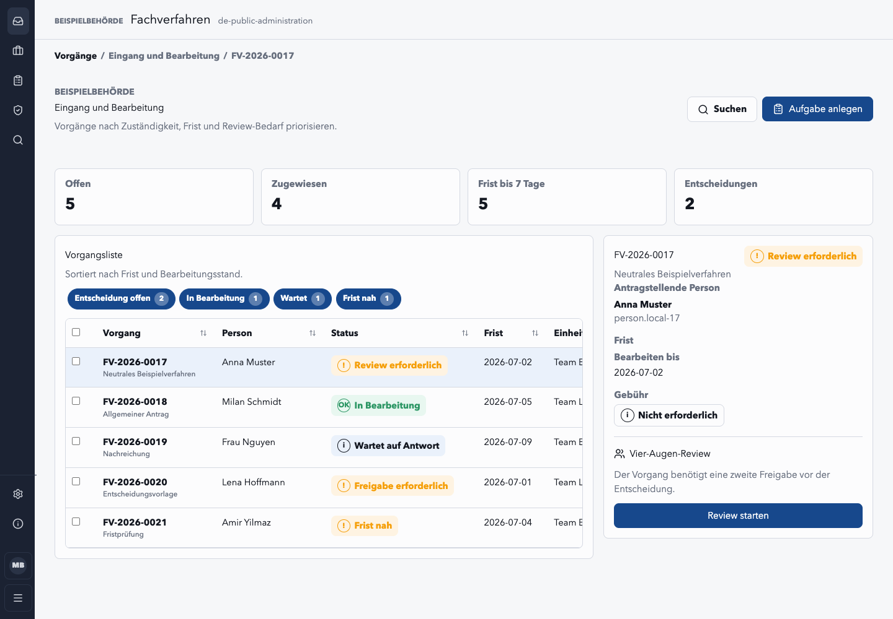

# Fachverfahren App Platform Template

[](https://gitlab.opencode.de/govtech-deutschland/platform-instances/deutschland-platform/govtech-ai/govtech-ai-app-fachverfahren-template/-/pipelines)
[](LICENSE)

**English summary:** This repository provides a reusable public-sector
application template for case-management portals and citizen services. It
combines a ready-to-run React app (three personas rendered from one typed
config), German/EU jurisdiction profiles, capability contracts, provider
adapters, conformance tooling and a template lifecycle so GovTech teams can
create maintainable domain applications instead of long-lived forks.

Dieses Repository ist der Startpunkt für wiederverwendbare
Fachverfahren- und Bürgerapp-Stacks auf Kubernetes. Es ist bewusst nicht nur
eine kopierbare App-Vorlage: Der wiederverwendbare Teil lebt in versionierten
Paketen, Provider-Packs, Jurisdiction-Packs und einem Conformance-Kit. Die
generierte Fachanwendung soll hauptsächlich Fachlogik enthalten.



## Zielbild

Die Architektur trennt vier Ebenen:

```text
Domain module
  -> public-sector capability contracts
  -> jurisdiction/provider adapters
  -> managed infrastructure services
```

Damit bleibt ein Fachverfahren portabel zwischen Plattformen, Ländern,
Kommunen und späteren SDK-Versionen. Codesphere ist ein Provider-Pack, Germany
ist ein Jurisdiction-Pack, und die D-Stack-Basisdienste werden als stabile
Capability-Ports modelliert.

## Deliverables

- `apps/fachverfahren`: die EINE dünne Kit-Kompositions-App (3 Personas); der governte Build überschreibt nur `src/leistung.config.ts`.
- `packages/platform-contracts`: Capability-Ports für Identität, Datenaustausch,
  Nachweisabruf, Zahlung, Postfach und weitere Verwaltungsfähigkeiten.
- `packages/public-sector-sdk`: administrativer Domain-Kernel,
  Domain-Module-Manifeste, Runtime-Konfiguration, Authorization und Audit.
- `packages/public-sector-ui`: KERN-orientierte UI-Fassade auf ShadCN-Primitiven.
- `packages/fachverfahren-kit`: wiederverwendbare Fachverfahren-Bausteine
  auf Tailwind/shadcn-Basis; der Katalog für Build-Agenten steht in
  `docs/reference/fachverfahren-kit-components.md`.
- `packages/provider-*`: lokale, Codesphere- und DVC-Providerprofile.
- `packages/conformance-kit`: Compliance-Profile und Evidence-Bundle-Planung.
- `packages/migration-kit`: Migrationsprofile für Legacy-Fachverfahren.
- `jurisdictions/*`: EU- und Deutschland-Packs ohne `country === "DE"`-Logik in
  der App.

## Stack

- Node.js `>=24 <25`, pnpm, strict ESM und TypeScript `NodeNext`.
- Frontend: React, Vite, Tailwind CSS und ShadCN-Primitive hinter dem
  `fachverfahren-kit` und der Public-Sector-UI-Fassade.
- Datenbank: PostgreSQL-Migrator und Plattformtabellen in
  `@senticor/app-store-postgres` (`pnpm run db:migrate`).
- Backend/BFF: (IST) Fastify-Web-Delivery-Runtime unter
  `apps/fachverfahren/server/` (Health, Security-Header, Metrics, Auth- und
  Workspace-Routen), beschrieben in `docs/reference/backend-fastify.md`;
  fachliche API-, OpenAPI- und Postgres-E2E-Routen sind explizite
  Ausbauschritte.
- Design/TDD: Storybook, Screen Contracts, semantische Tokens.

## Erste Schritte

Designer und Fachseite erkunden die Bausteine login-frei im Storybook:

```bash
pnpm install
pnpm run storybook
```

Neue Fachverfahren-Repositories entstehen über die Scaffold-CLI — siehe
„Verwendung als Template" weiter unten. Wer am Template selbst mitarbeitet,
findet die Entwickler-Anleitung (Frontend aus dem Template-Checkout starten,
Troubleshooting) in `CONTRIBUTING.md`.

### Lokal starten

Die Web-App ist anmeldepflichtig: die Landing (`/`) ist die einzige Route ohne
Anmeldung, alle Persona- und Workspace-Sichten liegen hinter dem Login. Für
den lokalen Start braucht es ein erreichbares Postgres — ein
Kubernetes-Manifest liegt unter `dev/postgres.yaml` (funktioniert mit Rancher
Desktop und Docker Desktop, wenn Kubernetes aktiviert ist):

```bash
mise install
pnpm install
pnpm run dev:api
```

`dev:api` baut Store und Server, fährt die Migrationen und startet die
App-Runtime auf `127.0.0.1:8080`. In einem zweiten Terminal den
Vite-Dev-Server starten; er proxied `/auth` + `/api` an die Runtime:

```bash
pnpm run dev
```

Beim ersten Start den Administrationszugang auf der Landing (`/`) mit dem
Bootstrap-Token `dev-setup` einrichten (Default nur für lokale Entwicklung).
Migrationen lassen sich separat fahren über:

```bash
pnpm run db:migrate
```

Ein konkretes Fachverfahren entsteht, indem die EINE Austausch-Naht
`apps/fachverfahren/src/leistung.config.ts` mit Fachdaten gefüllt wird;
danach den Vertrags-Snapshot aktualisieren:

```bash
pnpm --filter @senticor/fachverfahren emit:contract
```

Die verbindliche Arbeitsanweisung für Menschen und Coding Agents steht in
`AGENTS.md` (inklusive kanonischer Pfad-Karte und PLAN-vs-IST-Markierungen).
`pnpm install` richtet in Git-Checkouts Husky ein; die Hook-Details stehen in
`CONTRIBUTING.md` und `docs/reference/precommit-hooks.md`.

Die UX/UI-Regeln stehen in `docs/ux-ui/fachverfahren-ux-contract.md`, die
TDD-Regeln in `docs/reference/test-driven-development.md` und die
Storybook-Nutzung in `docs/reference/storybook.md`. Der wiederverwendbare
Komponenten-Katalog für Coding Agents steht in
`docs/reference/fachverfahren-kit-components.md`. Die geplante Mock-Schicht
ist in `docs/reference/mock-data-msw.md` beschrieben (PLAN).

Im Kubernetes-Profil liest die Web-App `APP_PG_URL` aus dem Secret
`app-postgresql`, Migrationen nutzen `APP_PG_DIRECT_URL` im `migrator`-Job.

Ein hermetischer E2E-Rauchtest existiert als `pnpm run test:e2e` (baut das
echte Bundle und prüft die SPA-Auslieferung). Eine Postgres-E2E-Suite
(`test:e2e:postgres`) und ein kombinierter Dev-Start (`dev:postgres`,
`dev:all`) sind (PLAN) Teil der Backend-Zielarchitektur und existieren im
Scaffold noch nicht.

Coding Agents nutzen `agent.discovery.json`, `docs/agents/bootstrap.md` und die
repo-lokalen Skills unter `.agents/skills`. Die Agent-Readiness und der
Standalone-Export sind in `docs/reference/opencode-agent-readiness.md`
beschrieben.

Vendor-neutrale Agenten starten mit Package-Script `agent:discover`, wählen
danach mit `agent:context` den task-spezifischen Kontext und erzeugen neue
Module aus App-Spezifikationen mit `app:new`.

GitLab-/opencode.de-Image-Builds nutzen Kaniko statt Docker-in-Docker, weil die
Runner als unprivilegierte Kubernetes-Pods laufen. Der Dockerfile-Vertrag,
Kaniko-Job und die pnpm-Filterreihenfolge sind in
`docs/reference/ci-image-builds.md` beschrieben.

GitHub `main` ist die kanonische Quelle. Nach erfolgreicher GitHub-CI wird der
validierte Commit automatisch nach GitLab/openCode gespiegelt:

```text
https://gitlab.opencode.de/govtech-deutschland/platform-instances/deutschland-platform/govtech-ai/govtech-ai-app-fachverfahren-template
```

Der Mirror-Workflow nutzt `GITLAB_MIRROR_TOKEN`; optional kann
`GITLAB_MIRROR_URL` das Ziel überschreiben. Ohne Token wird der Mirror-Schritt
mit Notice übersprungen, damit die eigentliche Validierungs-CI nicht wegen
fehlender Repository-Secrets rot wird.

## Verwendung als Template

Dieses Repository ist ein **versioniertes Template**, keine kopierbare
Vorlage. Neue Fachverfahren-Repositories entstehen ausschließlich über die
Scaffold-CLI:

```bash
pnpm run scaffold:domain-app -- --domain beispiel --target /tmp/app-beispiel
```

Die CLI schreibt die Domain-Identität um (Paketname, `apps/<domain>`,
Helm-Charts) und legt `.template/lock.json` als Provenienz an — die Basis für
spätere `template:update`-Migrationen und dafür, dass Template-eigene CI-Jobs
(z.B. `scaffold-health`) sich im Konsumenten selbst überspringen.

**Den Baum roh zu kopieren oder zu klonen ist als Konsumenten-Provisionierung
nicht unterstützt.** Eine Rohkopie behält die Vorlagen-Identität
(`senticor-app-fachverfahren-template`), erhält keine `.template/`-Provenienz
(und damit keinen Update-/Migrationspfad) und schleppt Template-eigene
CI-Jobs mit. Für bereits roh kopierte Bäume ist `template:adopt` der
Reparaturpfad.

Provenienz, Ownership, Updates, Migrationen und Fleet-Befehle stehen in
`docs/reference/template-lifecycle.md`.

App-Spezifikationen liegen unter `docs/examples/*/app.spec.yaml`. Der
Generator `pnpm run app:new` erzeugt daraus ein Modul-Gerüst unter
`modules/<domain>/`; die laufende App bindet solche Module derzeit nicht ein
(PLAN, siehe `modules/README.md`). Capability-IDs und verbotene
Reimplementierungen stehen in `platform/capabilities.json`.

## Projekt und Community

- Sicherheitsmeldungen: `SECURITY.md`
- Verhaltenskodex: `CODE_OF_CONDUCT.md`
- Beitragen: `CONTRIBUTING.md`
- Änderungen und Release-Hinweise: `CHANGELOG.md`
- Öffentliche Adopter und Evaluierungen: `ADOPTERS.md`

## Lizenz und Owner

Dieses Repository ist Open Source unter der **European Union Public Licence v. 1.2 (EUPL-1.2)** —
siehe [`LICENSE`](LICENSE). Copyright © 2024–2026 **Senticor GmbH** (Produkt: **Senticor AI**), die
das Projekt betreut. Beiträge werden unter derselben Lizenz (EUPL-1.2) eingebracht.

Mitgelieferte Open-Source-Komponenten und ihre Lizenzen sind in
[`THIRD-PARTY-NOTICES.md`](THIRD-PARTY-NOTICES.md) aufgeführt (Attribution nach EUPL-1.2 Art. 5).
Alle Produktions-Abhängigkeiten sind permissiv bzw. datei-/modulweise reziprok lizenziert; es gibt
kein starkes Copyleft und damit keinen Lizenzkonflikt mit der EUPL-1.2.

## Wichtige Regeln

- Dokumentation ist deutsch; Code, Typen, Variablen und Paketnamen sind Englisch.
- Fachlogik nutzt Ports aus `platform-contracts`, nie direkt Provider-SDKs.
- Browser-Konfiguration ist öffentlich und schema-versioniert.
- Geheimnisse, interne Upstreams und Service-Bindings bleiben serverseitig.
- Barrierefreiheit, Authorization, Audit, Mandate, Retention und Evidence sind
  Plattformfähigkeiten, keine späteren Add-ons.

Troubleshooting für die lokale Entwicklung (fehlendes `vite`-Binary,
Container-/LAN-Zugriff auf den Dev-Server) steht in `CONTRIBUTING.md`.
